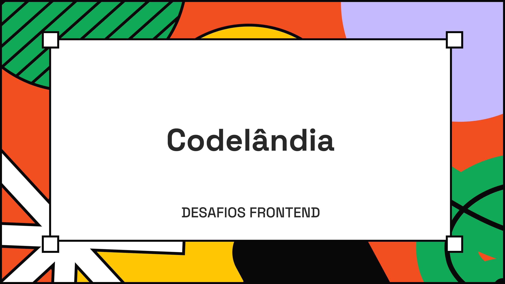

<div align="center">
    <h3>Frontend Challenges - Codelândia</h3>
    <p>A series of frontend challenges made by the Codelandia community created and supported by Iuri Silva, more than 40 prototypes developed in Figma as a reference for creating pages, using technologies such as HTML, CSS, JS and the like, and here are some of my solutions</p>
    
</div>

<hr>

### Where to start

Do you want to see any of my solutions? Get started by following the instructions below

- Clone this repository
```bash
    git clone https://github.com/jeancharlesx64/codelandia-challenges.git
```


- Open ```index.html``` files in your browser. 
  - See how the structure of each project works so you can access each challenge separately
      - assets
          - css
          - js
          - img
          - icon
      - index.html

### How to find the challenges?
You can access the challenges via the [Discord Community](https://discord.com/invite/QevDJqCzaY), or directly through the referenced prototypes on [Figma](https://www.figma.com/file/Yb9IBH56g7T1hdIyZ3BMNO/Desafios---Codel%C3%A2ndia?type=design&node-id=0-1&mode=design&t=CyFU3aX9OGmsx10L-0), good studies ;)


